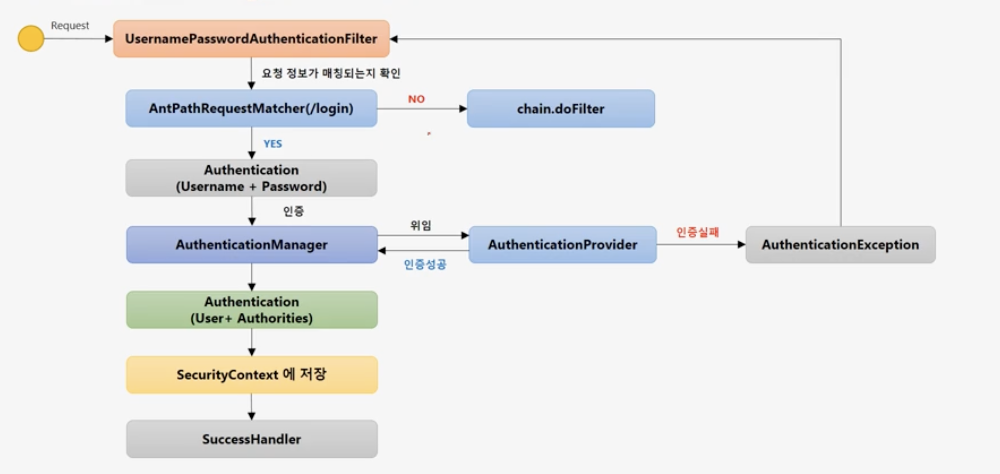
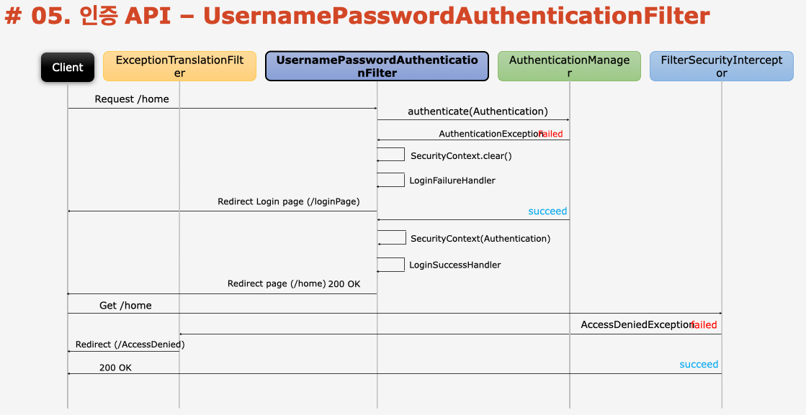
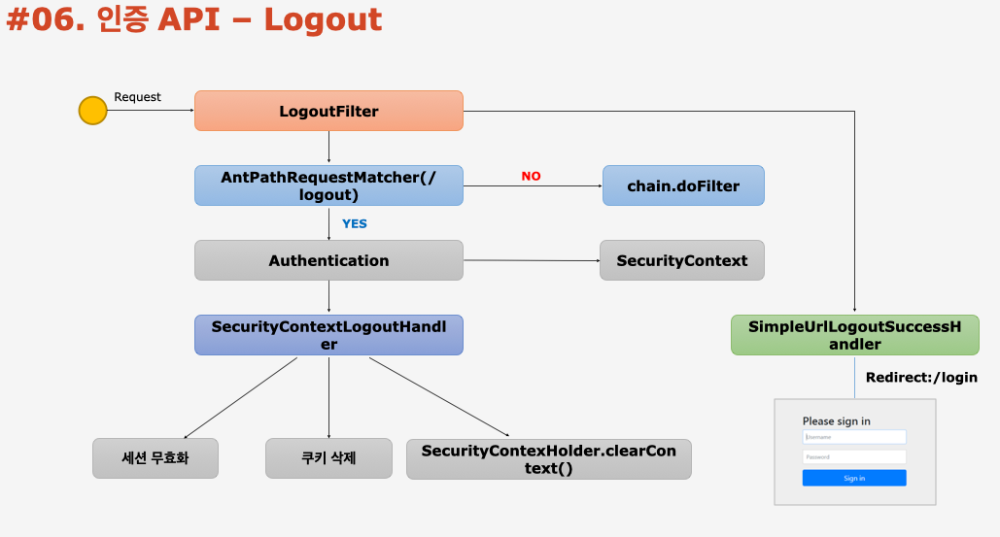

# 강의 내용 중점 정리

## Security 인증 API

### 1. Form 인증
- 인증이 안되면 로그인 페이지로 리다이렉트
    - 로그인 페이지는 커스텀으로 설정하지 않을 경우 Security에서 제공하는 Default Login페이지로 이동
- 로그인 페이지에서 POST 방식으로 username + password를 Request로 전달
- 로그인 성공시 SESSION 또는 인증 토큰 생성 및 저장
- 세션에 저장된 인증 토큰으로 홈 페이지 접근 및 인증 유지

### 1-1. Form Login 인증의 Method

```java
protected void configure(HttpSecurity http) throws Exception() {

  http.formLogin()                          // Form 로그인 인증 기능이 동작
    .loginPage("/login.html")               // 사용자 정의 로그인 페이지
    .defaultSuccessUrl("/home")             // 로그인 성공 후 이동 페이지
    .failureUrl("/login.html?error=true")   // 로그인 실패 후 이동 페이지
    .usernameParameter("username")          // 아이디 파라미터명 설정
    .passwordParameter("password")          // 패스워드 파라미터명 설정
    .loginProcessingUrl("/login")           // Login Form Action Url
    .successHandler(loginSuccessHandler())  // 로그인 성공 후 핸들러
    .failureHandler(loginFailureHandler())  // 로그인 실패 후 핸들러
}
```
### 2. UsernamePasswordAuthenticationFilter




### 3. Logout
  - Session 무효화, 인증토큰 삭제, 쿠키정보 삭제, 로그인 페이지로 Redirect(Default 설정)
  - Spring Security는 Logout 처리를 할 때 원칙적으로 POST 방식으로 처리
    - GET은 오류
    - Custom 설정을 통해 GET 방식으로 변경할 수 있음

### 3-1. Logout Method
```java
protected void configure(HttpSecurity http) throws Exception {
    http.logout()                                     // 로그아웃 처리  
      .logoutUrl("/logout")                           // 로그아웃 처리 URL 
      .logoutSuccessUrl("/login")                     // 로그아웃 성공 후 이동 페이지
      .deleteCookies("JSESSIONID", "remember-me")     // 로그아웃 후 쿠키 삭제 
      .addLogoutHandler(logoutHandler())              // 로그아웃 핸들러
      .logoutSuccessHandler(logoutSuccessHandler())   // 로그아웃 성공 후 핸들러
}
```

